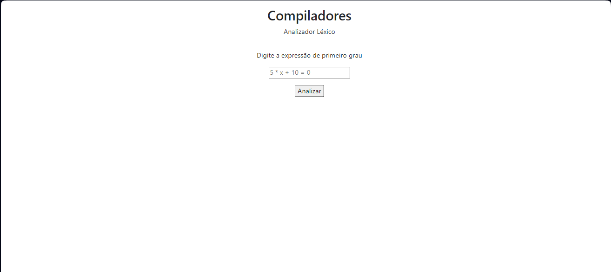
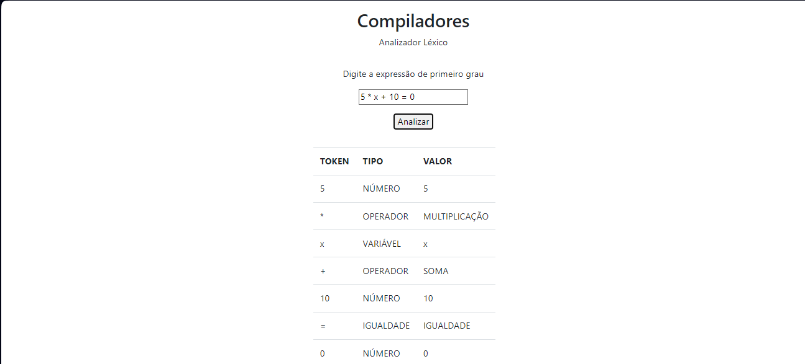

# Analizador léxido de expressão de primeiro grau

## Descrição
- Analisador léxico de expressões de primeiro grau, feito em Python, servido com node interface com Bootstrap, para a disciplina de Compiladores do Curso de Ciência da Computação - IFCE Tianguá.

